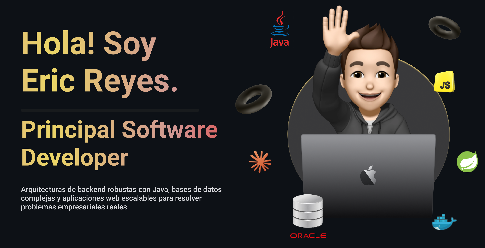
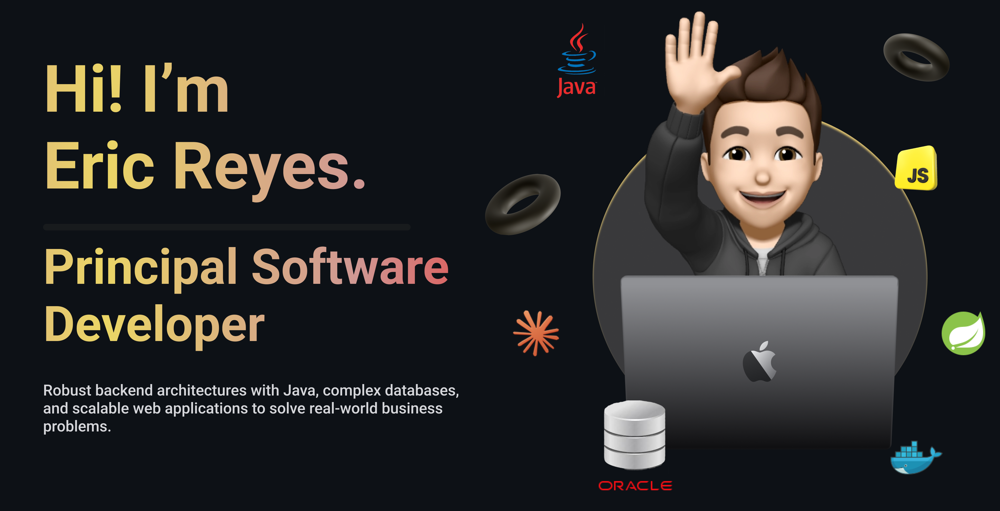

<details style="border: 2px solid #2ecc71; border-radius: 8px; padding: 12px; background-color: rgba(46, 204, 113, 0.05);">
<summary style="cursor: pointer; font-size: 16px; font-weight: 600; color: #2ecc71; user-select: none;">
  <span style="display: inline-block; margin-right: 8px;">🇲🇽</span>Español
</summary>

<div style="margin-top: 12px;">

# ¡Hola! Soy Eric Reyes 👋
## Principal Software Developer



---

### 🚀 Acerca de mí

Soy un profesional con más de 16 años de experiencia especializándome en el diseño, desarrollo y optimización de sistemas backend empresariales de alta disponibilidad.

*   **Backend Core:** Diseño de microservicios escalables utilizando **Spring Boot**, garantizando transacciones seguras, arquitecturas distribuidas y APIs altamente eficientes.
*   **Database Engineering:** Experto en tuning de consultas complejas, modelado de datos de misión crítica, administración avanzada en **Oracle DB** y **PostgreSQL**, y desarrollo ágil,
*   **Cloud & DevOps:** Migración y despliegue de infraestructuras empresariales aprovechando soluciones nativas de la nube en **AWS** y **OCI**, automatizadas mediante contenedores **Docker**.

---

### 🛠️ Tech Stack & Skills

#### ☕ Backend & Frameworks


#### 🗄️ Database Engineering


#### 🌐 Frontend Development


#### ☁️ Cloud & DevOps


---

### 📈 Estadísticas Dinámicas (Adaptativas Claro/Oscuro)

Aprovechando las características modernas de GitHub, las siguientes métricas se adaptan dinámicamente según el tema que use el visitante en su navegador:

```markdown
<!-- Las siguientes imágenes utilizan selectores adaptativos nativos en GitHub de manera automática -->
```

<p align="center">
  <picture>
    <source media="(prefers-color-scheme: dark)" srcset="https://github-readme-stats.vercel.app/api?username=ereyesMX&show_icons=true&theme=tokyonight&count_private=true">
    <source media="(prefers-color-scheme: light)" srcset="https://github-readme-stats.vercel.app/api?username=ereyesMX&show_icons=true&theme=default&count_private=true">
    
  </picture>
</p>

<p align="center">
  <picture>
    <source media="(prefers-color-scheme: dark)" srcset="https://github-readme-stats.vercel.app/api/top-langs/?username=ereyesMX&layout=compact&theme=tokyonight">
    <source media="(prefers-color-scheme: light)" srcset="https://github-readme-stats.vercel.app/api/top-langs/?username=ereyesMX&layout=compact&theme=default">
    
  </picture>
</p>

---

### 💼 Proyectos Destacados (Tendencia 2026)

#### 🏪 Core Banking Migration Platform
*   **Descripción:** Rediseño completo del sistema transaccional para un banco internacional, migrando lógica legacy PL/SQL hacia microservicios desacoplados.
*   **Impacto:** Reducción del 45% en los tiempos de respuesta de las APIs críticas de pagos.
*   **Tecnologías:** `Java`, `Spring Boot`, `Oracle DB`, `AWS ECS`, `Docker`.

#### 📊 Enterprise Analytics Dashboard
*   **Descripción:** Suite de analítica interna para el monitoreo de infraestructura de datos en tiempo real mediante reportes avanzados.
*   **Impacto:** Automatización de flujos operativos optimizando queries complejas reduciendo bloqueos transaccionales (*Deadlocks*).
*   **Tecnologías:** `Oracle APEX`, `PostgreSQL`, `React`, `TypeScript`, `OCI`.

---

### 🤝 Contribuciones Open Source

*   **Spring Data Extensions:** Colaboración activa en la optimización de dialectos específicos para cargas de trabajo masivas en bases de datos relacionales empresariales.
*   **Community Mentoring:** Co-creador de guías comunitarias en optimización de consultas SQL y patrones arquitectónicos limpios en Java para desarrolladores junior.

---

### 📬 Conectemos

Si deseas discutir sobre arquitectura de software, sintonización de bases de datos empresariales o nuevas oportunidades profesionales, no dudes en contactarme:

<a href="https://www.linkedin.com/in/ingericalbertorr/"></a>
<a href="mailto:eric.reyesdr@gmail.com"></a>

</div>

</details>

---

<details open style="border: 2px solid #3498db; border-radius: 8px; padding: 12px; background-color: rgba(52, 152, 219, 0.05);">
<summary style="cursor: pointer; font-size: 16px; font-weight: 600; color: #3498db; user-select: none;">
  <span style="display: inline-block; margin-right: 8px;">🇺🇸</span>English
</summary>

<div style="margin-top: 12px;">

# Hello! I'm Eric Reyes 👋
## Principal Software Developer



---

### 🚀 About Me

I'm a professional with over 16 years of experience specializing in the design, development, and optimization of highly available enterprise backend systems.

*   **Backend Core:** Design of scalable microservices using **Spring Boot**, ensuring secure transactions, distributed architectures, and highly efficient APIs.
*   **Database Engineering:** Expert in complex query tuning, mission-critical data modeling, advanced administration in **Oracle DB** and **PostgreSQL**, and agile development.
*   **Cloud & DevOps:** Migration and deployment of enterprise infrastructures leveraging cloud-native solutions on **AWS** and **OCI**, automated through **Docker** containers.

---

### 🛠️ Tech Stack & Skills

#### ☕ Backend & Frameworks


#### 🗄️ Database Engineering


#### 🌐 Frontend Development


#### ☁️ Cloud & DevOps


---

### 📈 Dynamic Statistics (Light/Dark Adaptive)

Leveraging modern GitHub features, the following metrics adapt dynamically based on the theme your browser uses:

```markdown
<!-- The following images use native adaptive selectors in GitHub automatically -->
```

<p align="center">
  <picture>
    <source media="(prefers-color-scheme: dark)" srcset="https://github-readme-stats.vercel.app/api?username=ereyesMX&show_icons=true&theme=tokyonight&count_private=true">
    <source media="(prefers-color-scheme: light)" srcset="https://github-readme-stats.vercel.app/api?username=ereyesMX&show_icons=true&theme=default&count_private=true">
    
  </picture>
</p>

<p align="center">
  <picture>
    <source media="(prefers-color-scheme: dark)" srcset="https://github-readme-stats.vercel.app/api/top-langs/?username=ereyesMX&layout=compact&theme=tokyonight">
    <source media="(prefers-color-scheme: light)" srcset="https://github-readme-stats.vercel.app/api/top-langs/?username=ereyesMX&layout=compact&theme=default">
    
  </picture>
</p>

---

### 💼 Featured Projects (2026 Trends)

#### 🏪 Core Banking Migration Platform
*   **Description:** Complete redesign of the transactional system for an international bank, migrating legacy PL/SQL logic to decoupled microservices.
*   **Impact:** 45% reduction in response times for critical payment APIs.
*   **Technologies:** `Java`, `Spring Boot`, `Oracle DB`, `AWS ECS`, `Docker`.

#### 📊 Enterprise Analytics Dashboard
*   **Description:** Internal analytics suite for real-time monitoring of data infrastructure through advanced reporting.
*   **Impact:** Automation of operational workflows optimizing complex queries reducing transactional locks (*Deadlocks*).
*   **Technologies:** `Oracle APEX`, `PostgreSQL`, `React`, `TypeScript`, `OCI`.

---

### 🤝 Open Source Contributions

*   **Spring Data Extensions:** Active collaboration in optimizing dialect-specific solutions for massive workloads in enterprise relational databases.
*   **Community Mentoring:** Co-creator of community guides on SQL query optimization and clean architectural patterns in Java for junior developers.

---

### 📬 Let's Connect

If you want to discuss software architecture, enterprise database tuning, or new professional opportunities, feel free to contact me:

<a href="https://www.linkedin.com/in/ingericalbertorr/"></a>
<a href="mailto:eric.reyesdr@gmail.com"></a>

</div>

</details>
